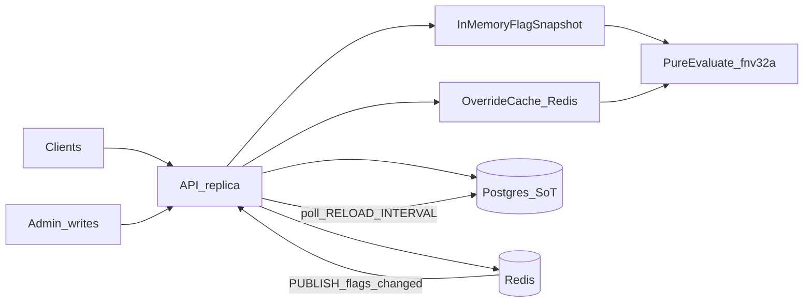

# Architecture

## Request lifecycle



## Components

| Layer | Role |
|-------|------|
| `internal/httpapi` | REST handlers, validation, status codes |
| `internal/flag` | Pure `Evaluate` + sticky `fnv32a` rollout |
| `internal/store/postgres` | Durable SoT (flags + user_overrides) |
| `internal/store/cached` | Snapshot + write-through + poll/pubsub |
| `internal/sync/redis` | `flags:changed` channel + override TTL cache |
| `internal/store/memory` | Test double for FlagStore |

## Resilience

| Failure | Behavior |
|---------|----------|
| Redis down after boot | Serve last flag snapshot; override lookups fall through to Postgres; `/healthz` returns `degraded` |
| Redis never connected (`REDIS_URL` set) | Run without pub/sub or override cache; `/healthz` returns `degraded` |
| Postgres down | `/readyz` fails; writes and evals that need overrides may error |
| Missed pub/sub | Full snapshot reload every `RELOAD_INTERVAL` (default 10s) bounds staleness |
| Cache stampede on overrides | `singleflight` per `(flag, user)` |

## Hash

```
bucket = fnv32a(flagName + ":" + userID) % 100
in_rollout = bucket < rollout_percent
```

Same inputs always yield the same bucket on every replica. Raising percent is monotonic for a given user.
