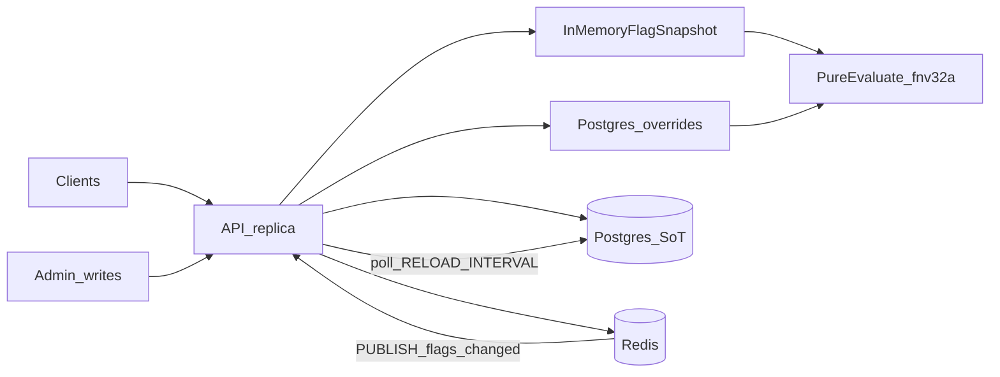

# Architecture

Explanation of how this service answers hard system-design questions.
Claims match the code in `internal/` at the time of writing.

## Request lifecycle



Warm evaluate reads flag config from the in-memory snapshot.
Override rows always come from Postgres on the evaluate path.
Redis is used only for `flags:changed` pub/sub invalidation, not for override storage or evaluation.

## Components

| Layer | Role |
|-------|------|
| `internal/httpapi` | REST handlers, validation, status codes |
| `internal/flag` | Pure `Evaluate` + sticky `fnv32a` rollout (rule A) |
| `internal/store/postgres` | Durable SoT for flags and `user_overrides` |
| `internal/store/cached` | Snapshot, write-through, poll, pub/sub apply |
| `internal/sync/redis` | `flags:changed` channel only |
| `internal/store/memory` | Test double for `FlagStore` |

## Why this shape

Postgres is the source of truth so every replica converges on the same durable rows.
The in-memory snapshot keeps flag config off the Postgres hot path for evaluate.
Pure `flag.Evaluate` keeps rule A testable without I/O.
Redis is optional acceleration for multi-replica freshness.
If Redis is missing, poll still converges within `RELOAD_INTERVAL`.

Overrides stay in Postgres so force on/off is correct as soon as the write commits.

## How a user gets on or off

`GET /v1/evaluate/{name}?user_id=...` and `POST /v1/evaluate` call `cached.Service.Evaluate`, then pure `flag.Evaluate`.

Rule A, in order:

1. Per-user override if a row exists. Reason `OVERRIDE`. Wins even over a global kill switch.
2. `enabled == false`. Reason `FLAG_DISABLED`. Global kill switch. Rollout is ignored.
3. If `rollout_percent < 100`, sticky bucket decides inclusion. Reasons `PERCENTAGE_ROLLOUT` or `PERCENTAGE_EXCLUDED`.
4. Else boolean on. Reason `BOOLEAN_TOGGLE`.

Evaluate loads the flag only from the snapshot.
A flag that exists in Postgres but is absent from the snapshot returns not found until reload or write-through lands it.
Admin `GetFlag` may fall through to Postgres.
Evaluate does not, so a cold miss cannot stampede the database.

## Percentage rollout

```
bucket = fnv32a(flagName + ":" + userID) % 100
in_rollout = bucket < rollout_percent
```

Same inputs yield the same bucket on every replica.
Raising percent is monotonic for a given user.
Mixing `flagName` into the key keeps one user from landing in the same bucket for every flag.
Implemented in `internal/flag/evaluate.go` via `hash/fnv` `New32a`.

## Concurrent writes

Postgres decides who wins.

- Create uses `PRIMARY KEY (name)`. Duplicate insert maps to HTTP 409.
- Patch is a single `UPDATE ... COALESCE(...)`. Last committed write wins. There is no row version or optimistic lock.
- Override upsert is `ON CONFLICT (flag_name, user_id) DO UPDATE`. Last committed override wins.
- Delete of a flag cascades overrides via FK `ON DELETE CASCADE`.

After a successful Postgres write on this replica, the service write-through updates the local snapshot, then publishes the flag name on `flags:changed`.
Other replicas apply that message by fetching one flag (or full reload for `*` or empty payload) or by the next poll.
Two admins racing end with the last Postgres commit.
Replicas may briefly disagree until pub/sub or poll catches up.
That window is bounded by `RELOAD_INTERVAL` when Redis is absent or messages are dropped.

## Traffic spikes

On the evaluate hot path:

- `RLock` the in-memory flag map
- `singleflight` coalesce concurrent override reads for the same `(flag, user)`, with the shared DB call detached from the leader's cancelable context and bounded by a short timeout
- one Postgres override lookup (or a coalesced shared result)
- pure `flag.Evaluate` in process

Not on the evaluate hot path:

- full `ListFlags` from Postgres (only reload or admin list)
- Redis get/set for flag bodies or overrides
- recomputing rollout tables

Admin create, patch, delete, and override writes still hit Postgres.
Spike tolerance for evaluation therefore depends on snapshot hit rate and override query cost, not on Redis throughput.

## Stale snapshot

Freshness mechanisms:

- Write-through on the writing replica after Postgres success
- Redis `PUBLISH` on `flags:changed` for peer invalidation
- Full snapshot reload every `RELOAD_INTERVAL` (default 10s)

A successful empty `ListFlags` clears the warm snapshot.
That matches Postgres as source of truth when every flag was deleted.
Reload and pub/sub apply merge per flag by `UpdatedAt` so a late fetch cannot overwrite a newer write-through row.

Fail-open versus fail-closed, as implemented:

| Case | Behavior |
|------|----------|
| Redis down after boot, or never connected when `REDIS_URL` is set | Keep serving the last flag snapshot. `/healthz` is `degraded`. Poll still reloads from Postgres. |
| Redis not configured (`wantRedis` false) | `/healthz` is `ok`. Poll only. |
| Missed pub/sub message | Next poll reloads. Staleness bounded by `RELOAD_INTERVAL`. |
| Override Postgres error during evaluate | Request fails. No silent ignore of overrides. |
| Flag missing from snapshot on evaluate | Not found. No DB fill. |
| Bulk evaluate with any missing flag | HTTP 404 after the service returns. Fail closed. Partial success is not returned. |

## Validation at the HTTP boundary

`internal/httpapi` rejects bad input before the store runs.

- Identifiers (`name`, `user_id`) must match `^[a-zA-Z0-9._-]{1,64}$`
- JSON bodies capped at 1 MiB
- `rollout_percent` must be 0 through 100 when present (create defaults to 100)
- Create requires a non-empty name
- Patch requires at least one of `enabled`, `description`, `rollout_percent`
- Evaluate requires `user_id`
- Bulk evaluate requires a non-empty `flags` list, at most 100 names, and dedupes repeats

Postgres also checks `rollout_percent` with a `CHECK` constraint.
FK rejects overrides for unknown flags.

## Creating and updating flags

| Action | API | Persistence |
|--------|-----|-------------|
| Create | `POST /v1/flags` | Insert into `flags`, write-through snapshot, publish name |
| List / get | `GET /v1/flags`, `GET /v1/flags/{name}` | Snapshot first; get may fall through to Postgres |
| Patch | `PATCH /v1/flags/{name}` | Partial update in Postgres, write-through, publish |
| Delete | `DELETE /v1/flags/{name}` | Delete flag (cascades overrides), drop from snapshot, publish |
| Set override | `PUT /v1/flags/{name}/users/{userID}` | Upsert `user_overrides` only. No snapshot change. No pub/sub. |
| Clear override | `DELETE /v1/flags/{name}/users/{userID}` | Delete override row. Next evaluate reads Postgres again. |

Overrides intentionally skip pub/sub.
Every evaluate already reads overrides from Postgres, so force on/off does not wait for snapshot refresh.

## Health versus readiness

- `/healthz` always returns HTTP 200 with `status` `ok` or `degraded`. Degraded means Redis was configured (`wantRedis`) but missing or failing `Ping`. The process can still serve flag config from the snapshot. Override lookups still need Postgres.
- `/readyz` pings Postgres. Failure is HTTP 503. Load balancers and App Platform should probe `/readyz` so a replica without the SoT leaves the pool.

## Resilience summary

| Failure | Behavior |
|---------|----------|
| Redis down after boot | Last flag snapshot remains. Overrides still go to Postgres. `/healthz` is `degraded`. |
| Redis never connected (`REDIS_URL` set) | No pub/sub. Poll only. `/healthz` is `degraded`. |
| Redis not desired | No pub/sub. `/healthz` is `ok`. |
| Postgres down | `/readyz` fails. Writes fail. Every evaluate fails because override lookup always queries Postgres, even when no override row exists. |
| Missed pub/sub | Poll every `RELOAD_INTERVAL` bounds staleness. |
| Empty `ListFlags` during reload | Snapshot cleared. |
| Concurrent override lookups | `singleflight` per `(flag, user)` with a cancel-detached DB timeout. |
| Bulk missing flag | Fail closed with 404. |
